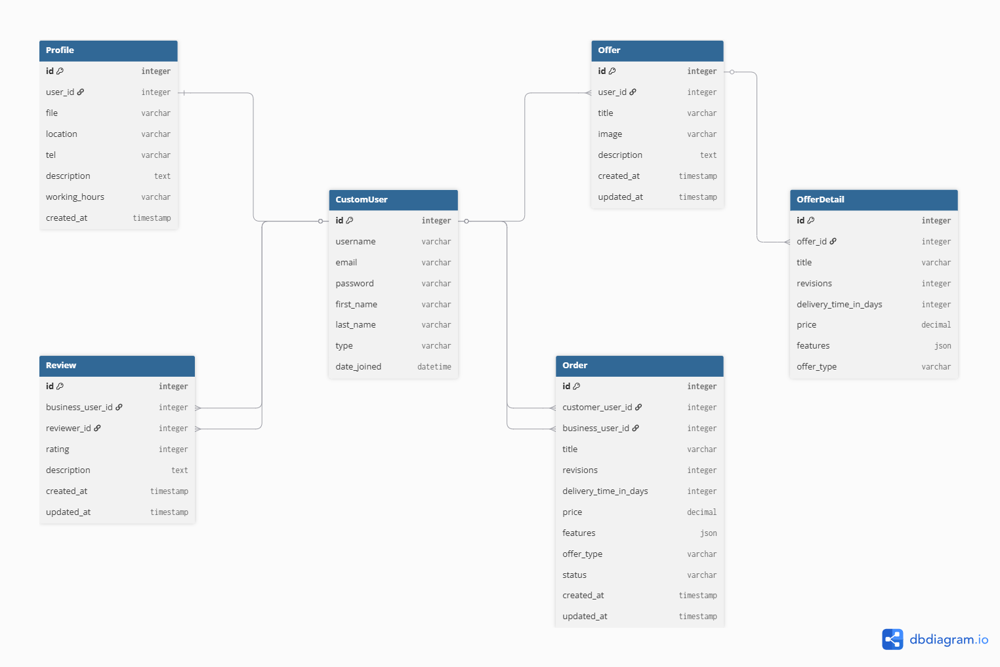

# Coderr Backend

Coderr is a freelance marketplace platform inspired by Fiverr and Upwork. This repository contains the **Django REST Framework backend** for the Coderr platform.

The frontend is maintained separately and is **not** included in this repository.

---

## Tech Stack

- **Python** 3.14
- **Django** 6.0
- **Django REST Framework** 3.17
- **SQLite** (default development database)
- **Token Authentication**

---

## Features

- User registration and login with token-based authentication
- Two user types: `customer` and `business`
- Profile management for each user (auto-created on registration)
- CRUD operations for offers, with nested offer details (basic / standard / premium)
- Order creation as a snapshot from an offer detail (orders preserve their state independently of future offer changes)
- Review system with one review per business per customer
- Platform-wide statistics endpoint (`/api/base-info/`)
- Filtering, searching, ordering and pagination on the offers list
- Role-based permissions on every endpoint
- 100 automated tests with 98% code coverage

---

## Database Schema



---

## Project Structure

```
coderr-backend/
├── auth_app/          # Registration, login, custom user model
├── profile_app/       # User profile management
├── offers_app/        # Offers and offer details
├── orders_app/        # Orders and order counts
├── reviews_app/       # Reviews
├── base_info_app/     # Platform statistics
└── core/              # Project settings and root URLs
```

Each app contains an `api/` folder with `serializers.py`, `views.py`, `urls.py` and `permissions.py`.

---

## Setup

### 1. Clone the repository

```bash
git clone https://github.com/RefiyeK/coderr-backend.git
cd coderr-backend
```

### 2. Create and activate a virtual environment

**Windows (PowerShell):**
```bash
python -m venv env
.\env\Scripts\Activate.ps1
```

**macOS / Linux:**
```bash
python -m venv env
source env/bin/activate
```

### 3. Install dependencies

```bash
pip install -r requirements.txt
```

### 4. Create environment file

Copy `.env.template` to `.env` and fill in the values:

```bash
cp .env.template .env
```

Then open `.env` and set:

```
SECRET_KEY=<a-long-random-string>
DEBUG=True
ALLOWED_HOSTS=127.0.0.1,localhost
```

You can generate a Django secret key with:

```bash
python -c "from django.core.management.utils import get_random_secret_key; print(get_random_secret_key())"
```

**Note on `DEBUG`:** The `.env.template` ships with `DEBUG=False` as a safe production default. For local development, set `DEBUG=True` in your `.env` so error tracebacks are shown and the Django admin panel is styled correctly. Never deploy a production server with `DEBUG=True`.

### 5. Run migrations

```bash
python manage.py migrate
```

### 6. Create a superuser (optional, for the admin panel)

```bash
python manage.py createsuperuser
```

### 7. Start the development server

```bash
python manage.py runserver
```

The API is now available at `http://127.0.0.1:8000/`.

---

## Running Tests

Tests use a separate settings file with an in-memory SQLite database for speed:

```bash
python manage.py test --settings=core.test_settings
```

To measure code coverage (install `coverage` first with `pip install coverage`):

```bash
coverage run --source='.' manage.py test --settings=core.test_settings
coverage report
```

---

## API Overview

All endpoints are prefixed with `/api/`.

| Endpoint | Methods | Description |
|---|---|---|
| `/registration/` | POST | Register a new user |
| `/login/` | POST | Log in and receive a token |
| `/profile/<pk>/` | GET, PATCH | Retrieve or update a user profile |
| `/profiles/business/` | GET | List all business profiles |
| `/profiles/customer/` | GET | List all customer profiles |
| `/offers/` | GET, POST | List or create offers |
| `/offers/<id>/` | GET, PATCH, DELETE | Retrieve, update or delete an offer |
| `/offerdetails/<id>/` | GET | Retrieve a single offer detail |
| `/orders/` | GET, POST | List or create orders |
| `/orders/<id>/` | PATCH, DELETE | Update status or delete an order |
| `/order-count/<business_user_id>/` | GET | Count of in-progress orders |
| `/completed-order-count/<business_user_id>/` | GET | Count of completed orders |
| `/reviews/` | GET, POST | List or create reviews |
| `/reviews/<id>/` | PATCH, DELETE | Update or delete a review |
| `/base-info/` | GET | Platform statistics |

For full request/response formats and permissions, see the API documentation provided separately.

---

## Notes

- The `db.sqlite3` file is excluded from version control and will be created locally on the first migration.
- The `.env` file is excluded from version control. Use `.env.template` as a starting point.
- Authentication is required for most endpoints. Pass the token in the `Authorization: Token <key>` header.